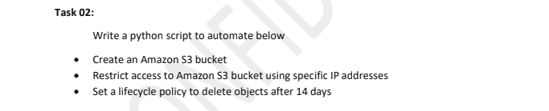
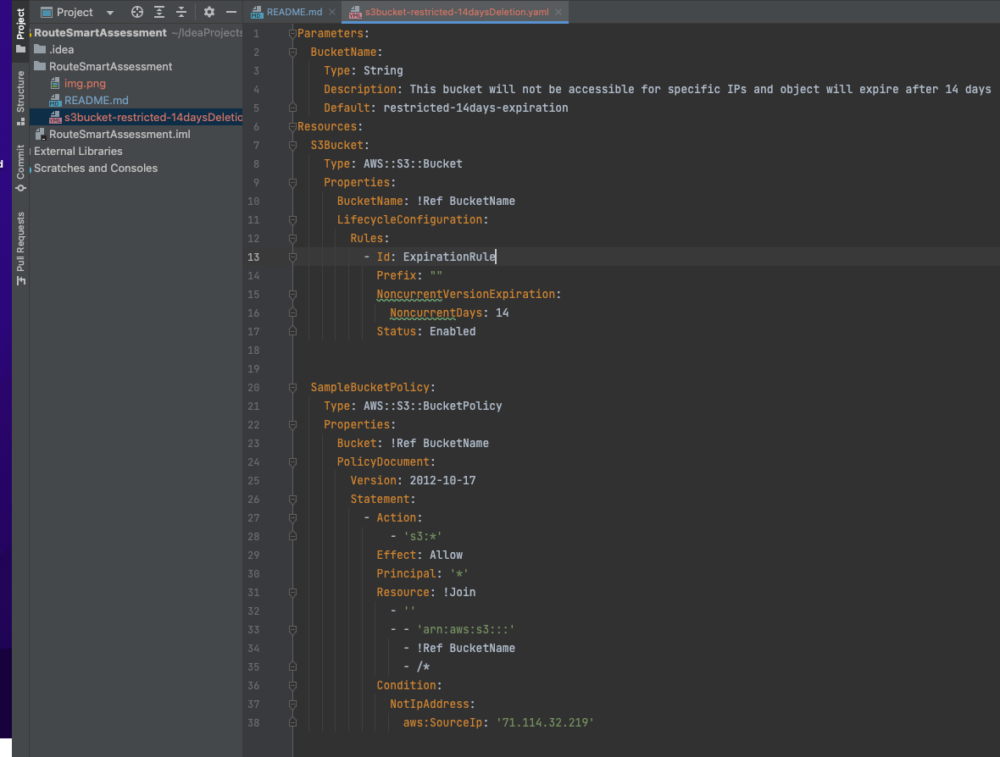
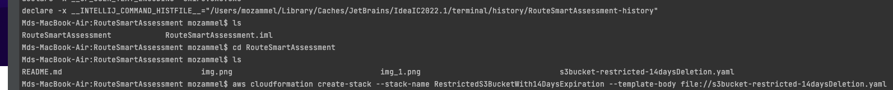
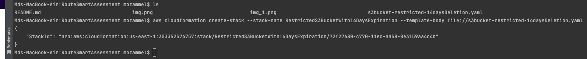
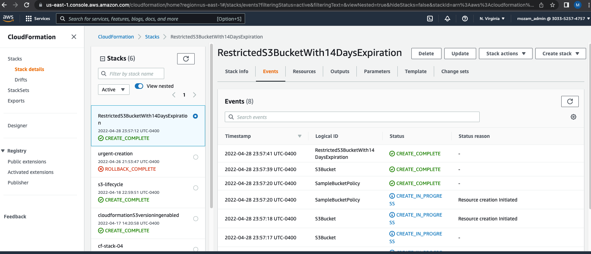
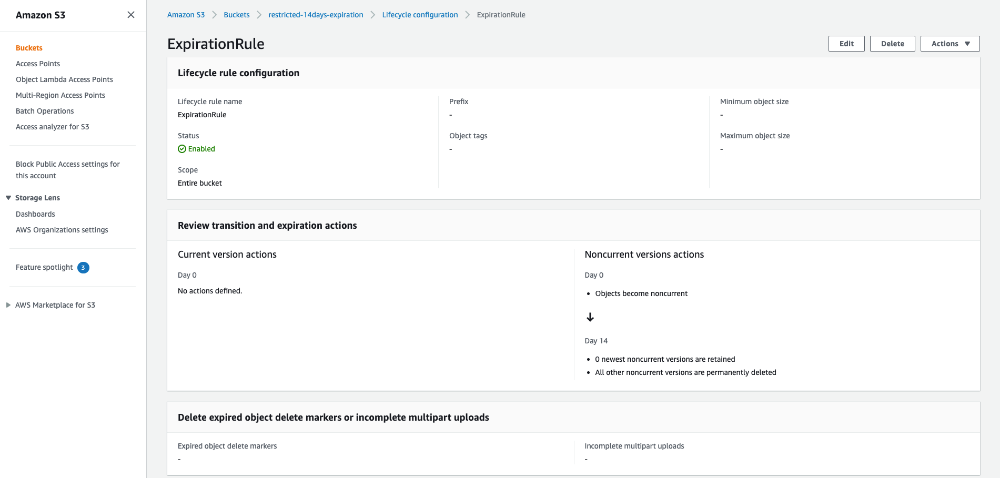

# RouteSmartAssessment

The assessment needs to be automated with a python script. Since I don't have
much experience with python scripting and the same job can be done with 
cloudformation template, I'll first try that approach first. And then will try with 
python scripting. 

Among all requirements, second requirement seems little confusing to me. 
As I understood, I need to restrict an IP address or multiple IP addresses from 
accessing my bucket. So I'll try to do this with CF template first.

Steps followed : 
1. Template created with required resource and configurations. The Template will create a bucket named 
"s3bucket-restricted-14daysDeletion" with an expiration policy of 14 days and will allow access to all IPs 
except the specific IP mentioned in the template. Note that the bucket is not version enabled. 

2. Run create-stack command from the terminal. 

3. An StackId is returned in the console

4. Now Let's go to the AWS Cloudformation Console to verify if the stack creation is completed successfully or rollback 
initiated. Looks like stack created successfully - 

5. Let's go to AWS S3 to verify the bucket creation and the lifecycle configuration - 

