# RouteSmartAssessment

# **Task02:**

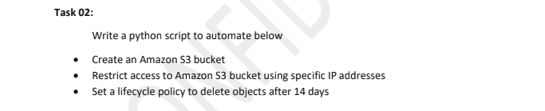

The assessment needs to be automated with a python script. Since I don't have
much experience with python scripting and the same job can be done with 
cloudformation template, I'll first try that approach first. And then will try with 
python scripting. 

Among all requirements, second requirement seems little confusing to me. 
As I understood, I need to restrict an IP address or multiple IP addresses from 
accessing my bucket. So I'll try to do this with CF template first.

Steps followed : 
1. Template created with required resource and configurations. The Template will create a bucket named 
"s3bucket-restricted-14daysDeletion" with an expiration policy of 14 days and will allow access to all IPs 
except the specific IP mentioned in the template. Note that the bucket is not version enabled. 

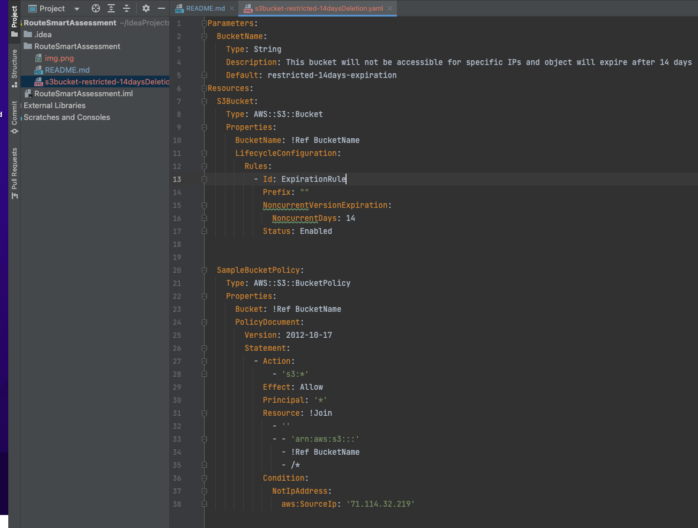

2. Run create-stack command from the terminal. 

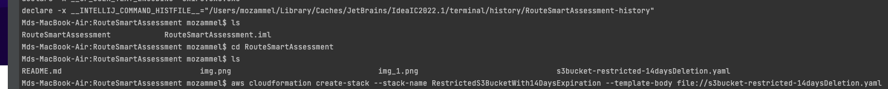

3. An StackId is returned in the console

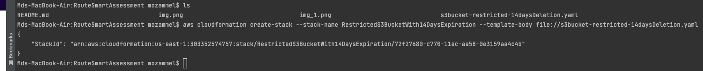

4. Now Let's go to the AWS Cloudformation Console to verify if the stack creation is completed successfully or rollback 
initiated. Looks like stack created successfully - 

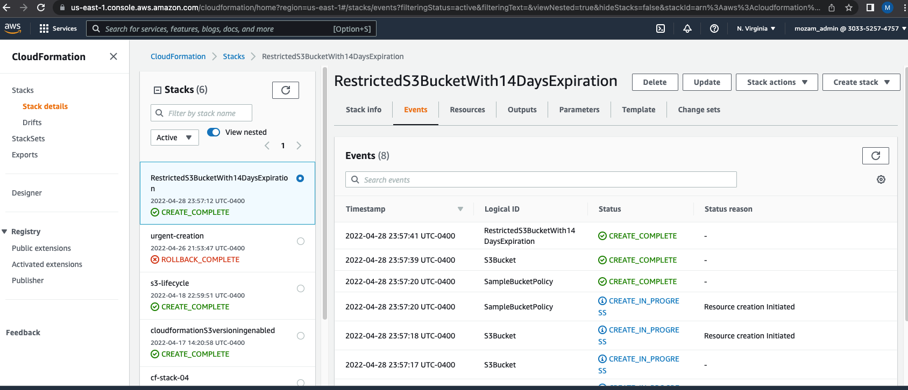

5. Let's go to AWS S3 to verify the bucket creation and the lifecycle configuration - 

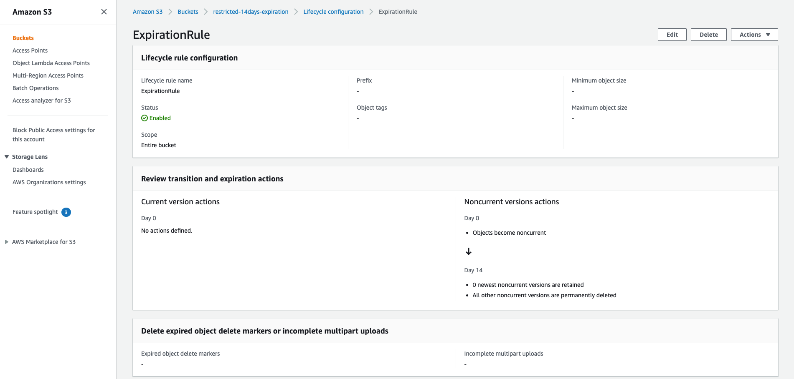

# **Task 01:**

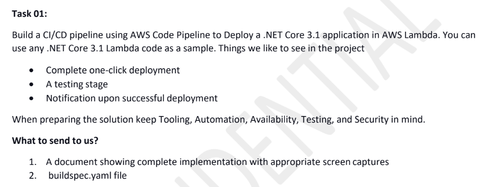

As per my understanding, I need to use an AWS Lambda code scripted with .NET Core 3.1 and build a complete
one click deployment process using AWS Code Pipeline which will deploy this application to AWS Lambda. And then 
I need to build a testing stage which will send some form of notification, might be email, upon a successful
deployment. 

## **Required Resources:**

1) Visual Studio for .NET Core 3.1 application.
2) GitHub Repository to store the application.
3) AWS IAM to create required Roles.
4) AWS Secrets Manager to store AWS programmatic credentials.
5) AWS Code Build to build and package the application.
6) AWS S3 to store the artifacts.
7) AWS Code Deploy to deploy the application to AWS Lambda using AWS Cloudformation.
8) AWS Code Pipeline to chain all the stages together for one click deployment.
9) AWS API Gateway to create a testing stage - couldn't finish in time. 
10) AWS SNS to send notification to the email - couldn't finish in time.

## **Details:**

I successfully created a CI/CD Pipeline to deploy my demo application "AWSLambdaProjectDotNet" to AWS
Lambda using AWS Code Pipeline. Below are the steps I followed - 

1. Downloaded Microsoft Visual Studio 2019 and AWS toolkit for Visual Studio 2022. Scripted a simple Lambda function
which print an input string to Lower case. The application tested locally and found working successfully.
GitHub link for the application repo-
   [https://github.com/mozammel2246/AWSLambdaProjectDotNet](AWSLambdaProjectDotNet)

2. A Secret, "mozam-admin-keys", has been created to AWS Secrets Manager which contains my users Access Key 
and Secret Access Key.
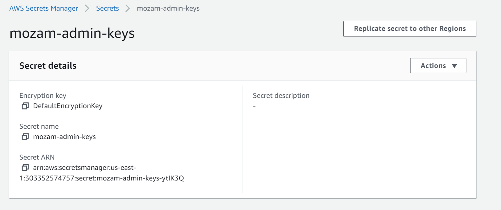

3. A Build project, AWSLambdaProjectDeployment, has been created using AWS Code Build to build the 
application and store the artifacts to a newly created S3 bucket, artifact-lambda-project, to a zip package. Note
that, I didn't use AWS Code Commit for the application repo. So during building project in AWS Code Build, I used
GitHub as the source of the application repo. And I had to add S3 bucket, Secrets Manager access policy 
to the role created for Code Build to store the artifact to the targeted bucket. 

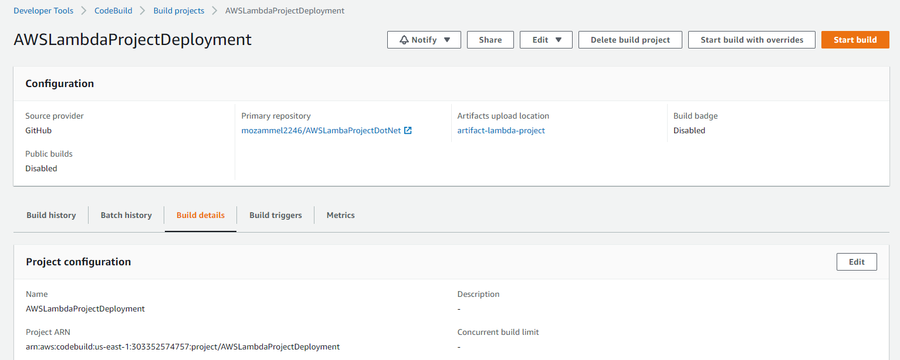

4. A buildspec file written in yaml format where all the necessary commands were scripted to run the Build project
created in Code Build. This yaml file consists of necessary information about environment, phases and artifacts
during building stage. In phases, a bunch of specific commands were scripted to run during install, pre_build, build 
and post_build. And then buildspec file was pushed to GitHub under project root. 

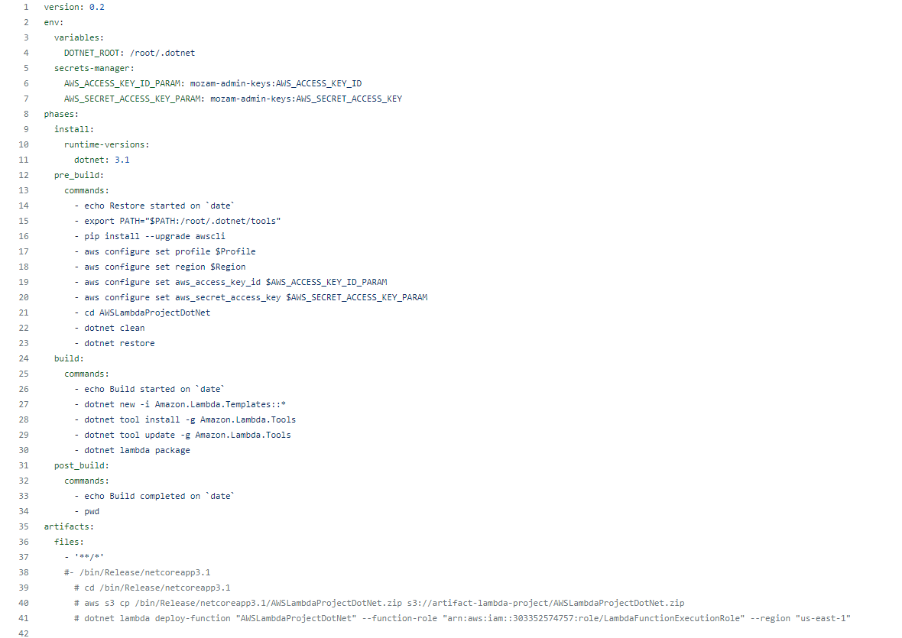

5. Now, it was ready to test the Build project from Code Build. Project was built successfully and created an
artifact to the S3 bucket, codepipeline-us-east-1-455962676791.s3.amazonaws.com/DotNetDeployToAWSLam, 
as a zip package. 

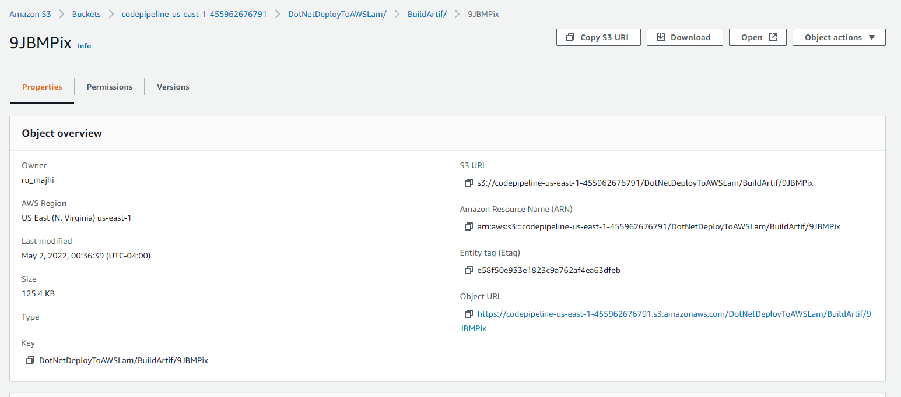

7. An application, demo-app, were created in AWS CodeDeploy with deployment group, g1, to deploy the app to 
AWS Lambda. A stack in AWS Cloudformation were created to define the properties, runtime etc. during the 
app deployment to AWS Lambda using template file in yaml format.

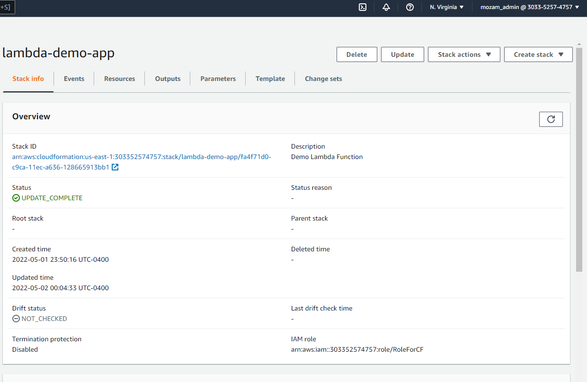

7. Finally, a pipeline, DotNetDeployToAWSLambda, has been created in AWS CodePipeline to link all the stages - 
source, build and deploy together and release the changes successfully.

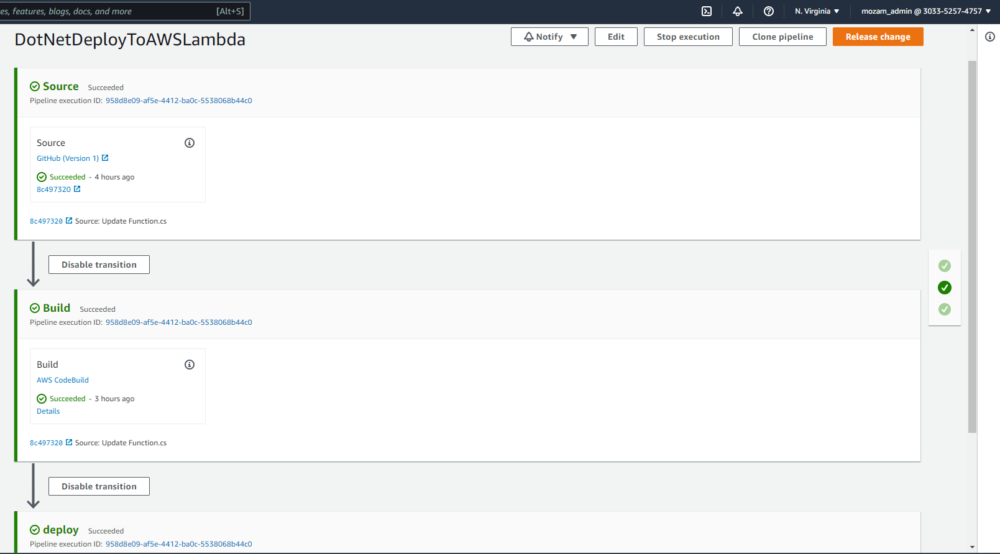

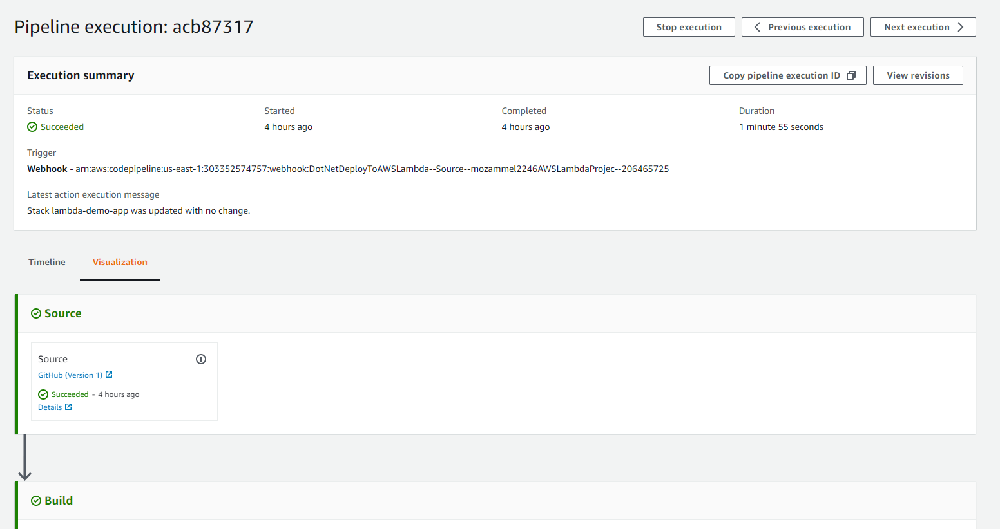

8. Also Lambda function, AWSLambdaProjectDotNet, successful deployment was verified from AWS Lambda 
console -

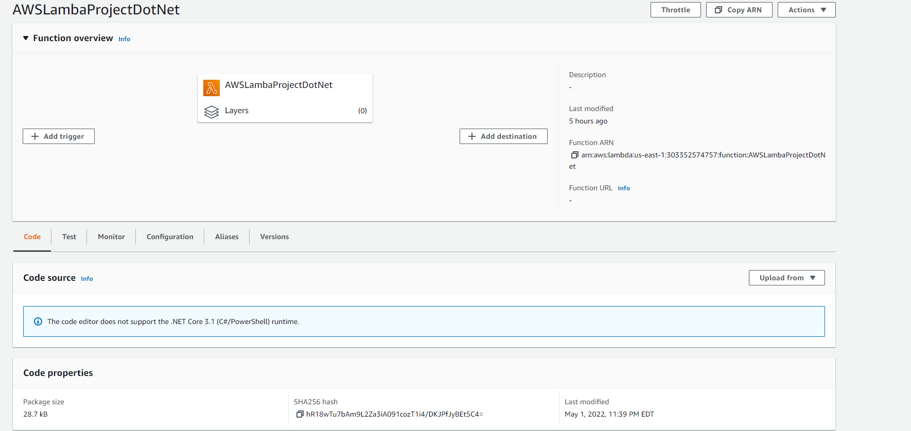

